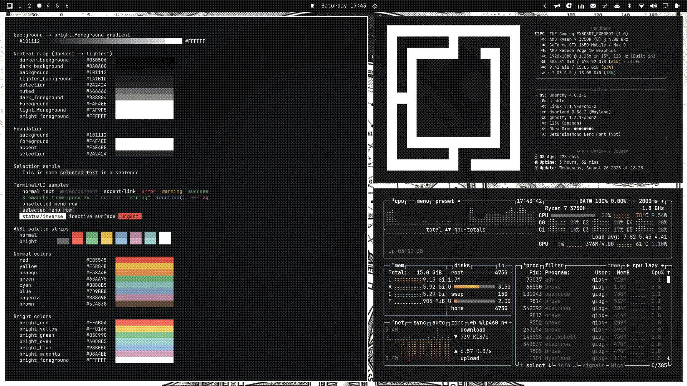
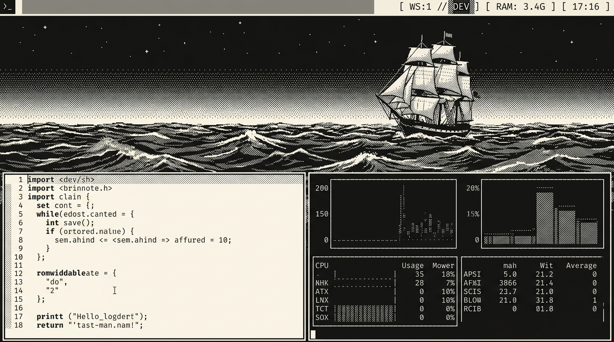
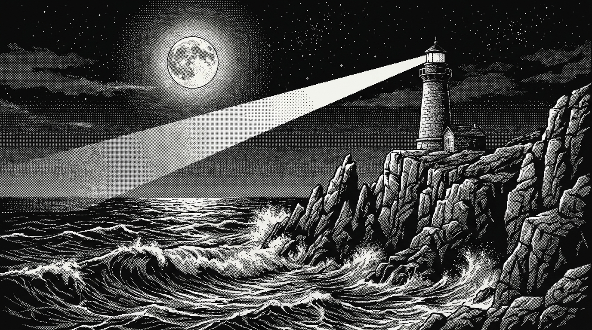
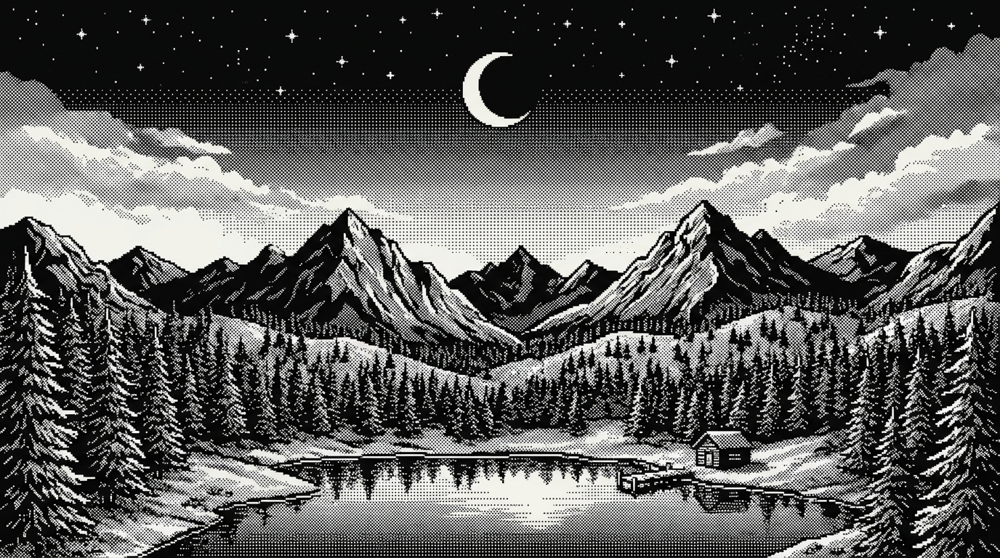
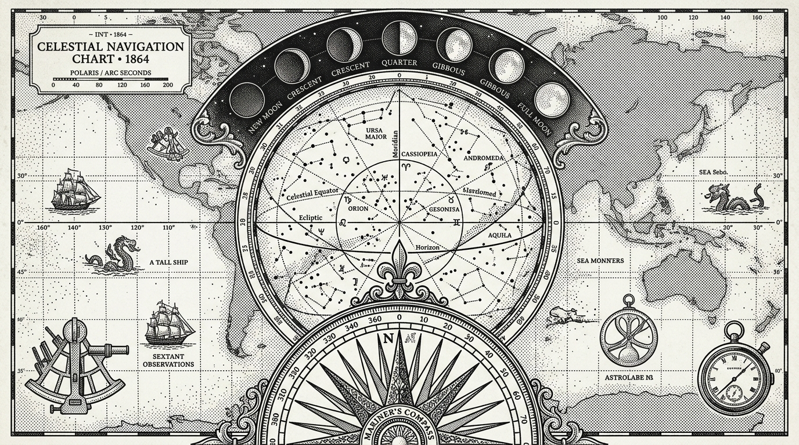
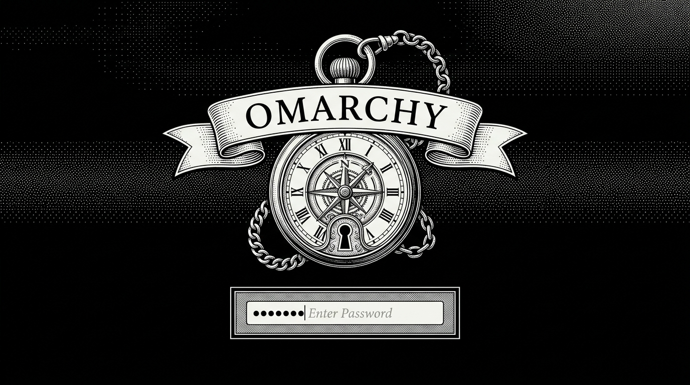

# Intaglio — Omarchy Theme 🏛️

A 1-bit fine print and Bayer dither desktop theme for [Omarchy](https://omarchy.org/). Inspired by the classical art of intaglio copperplate engraving and early 1984 Macintosh computing designed by Susan Kare.

The palette pairs high-contrast **Paper White** (`#F4F4EE`) typography and active borders with deep **Matte Ink Black** (`#101112`) surfaces, textured **Slate Halftones** (`#666666`), and traditional archival inks (**Stamp Red**, **Seal Amber**, **Faded Cobalt**). Features razor-sharp `0px` pixel geometry and an active real-time GLSL Bayer dither shader for desktop media.



---

## 🎨 Palette

| Role | Hex | Description |
| :--- | :--- | :--- |
| **Accent** | `#F4F4EE` | Paper White |
| **Background** | `#101112` | Matte Ink Black |
| **Foreground** | `#F4F4EE` | Crisp Lettering White |
| **Selection** | `#242424` | Charcoal Engraving |
| **Muted** | `#666666` | Slate Halftone Stipple |
| **Red** | `#E05545` | Stamp / Wax Seal Red |
| **Yellow** | `#E5B84B` | Compass Ochre |
| **Orange** | `#E58A4B` | Terracotta Clay |
| **Blue** | `#7D9BB8` | Nautical Sea Slate |
| **Green** | `#6BAA75` | Lichen / Verdigris |
| **Cyan** | `#88B8B5` | Glacial Mist |
| **Magenta** | `#B8869E` | Faded Velvet |
| **Brown** | `#5C4838` | Timber Umber |

---

## 🖼️ Included Wallpapers

| The Tall Ship (`1.jpg`) | The Coastal Lighthouse (`2.jpg`) |
| :---: | :---: |
|  |  |
| **The Mountain Forest (`3.jpg`)** | **Celestial Navigation Chart (`4.jpg`)** |
|  |  |

Cycle through wallpapers anytime with:
```bash
omarchy theme bg next
```

---

## 🔒 Lock Screen & Boot Emblem

The lockscreen features an antique 1800s pocket watch compass emblem with Roman numerals, exposed gear mechanism stippling, and a classical engraved **"OMARCHY"** banner.



---

## 📦 What's Included

- `colors.toml` — Master semantic palette driving all Omarchy native templates.
- `hyprland.lua` — Razor-sharp `0px` corner rounding, 2px crisp paper-white borders (`#F4F4EE`), disabled blur and soft shadows.
- `shell.toml` — Full Quickshell Quattro surface mapping for status bar, launcher, notifications, popups, and lockscreen.
- `backgrounds/` — 4 curated 1-bit dithered wallpapers (`1.jpg`–`4.jpg`).
- `unlock.png` & `preview-unlock.png` — Branded 1-bit pocket watch lockscreen and Plymouth boot artwork.
- `preview.png` — 1920x1080 theme selector preview card.
- `icons.theme` — Set to `HighContrast` for authentic monochrome folder and file manager glyphs.
- `keyboard.rgb` — Pure paper white (`ffffff`) LED keyboard backlight color.
- `btop.theme` — Dithered braille system telemetry graphs.
- `neovim.lua` — Aether.nvim colorscheme tuned to the Intaglio high-contrast palette.
- `vscode.json` — VS Code color theme integration.
- `chromium.theme` — Chromium browser frame theming.

---

## 🚀 Installation & Usage

### Option 1: Via Omarchy Menu (GUI)
1. Open the Omarchy menu: `SUPER + ALT + SPACE`
2. Go to **Install > Theme**
3. Enter the repository URL: `https://github.com/JoeJoeflyn/omarchy-intaglio-theme`

### Option 2: Via Omarchy CLI
```bash
omarchy theme install https://github.com/JoeJoeflyn/omarchy-intaglio-theme
```

### Option 3: Apply Directly
```bash
omarchy theme set "Intaglio"
```

### Lock Screen
```bash
omarchy system lock
```

---

## 📄 License
MIT
